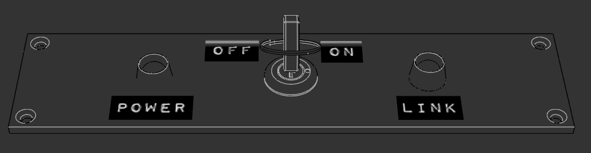
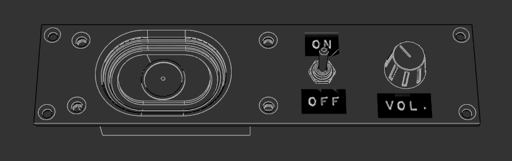
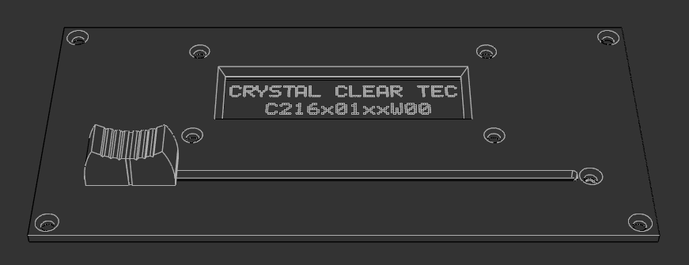
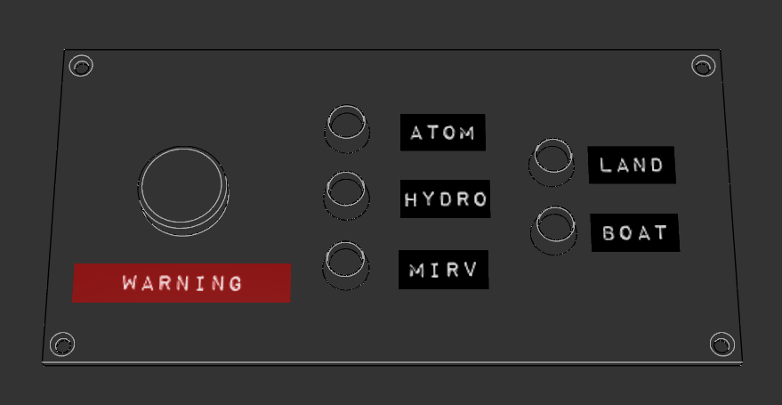
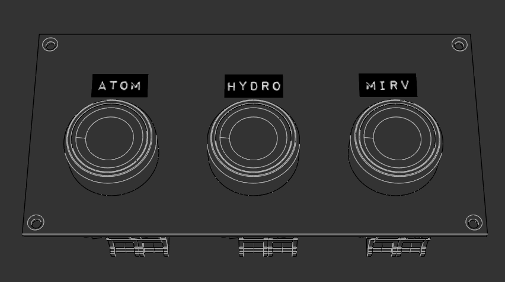

# Openfront Tactical Suitcase (OTS Hardware)

Hardware controller for Openfront - a modular, ruggedized game controller system.

<!-- TODO: Add 10U rack layout diagram -->


<!-- TODO: Add main controller render -->


## Overview

The Openfront Tactical Suitcase is a physical hardware device that provides tactile controls and visual feedback for the Openfront game. It features a modular design where different functional modules can be added or removed based on needs.

## Architecture

### Main Controller
- **MCU**: ESP32-S3
- **Role**: Central coordinator and WebSocket server
- **Connectivity**: Hosts WebSocket server for ots-simulator client to connect to
- **Bus Interface**: Controls and communicates with daughter boards via shared bus

### Module Bus Specification
- **Power**: Shared power rail (voltage TBD - 5V/3.3V/12V)
- **I2C**: For low-speed module communication and configuration
- **CAN Bus**: For real-time game state updates and reliable messaging
- **Physical**: Standard connectors (type TBD)

### Module Design
- **Modular Units**: Standard physical sizes (dimensions TBD)
- **Domain-specific**: Each module handles specific aspect of game state

## Software Integration

### Firmware (ots-fw-main)
- Runs on ESP32-S3 main controller
- WebSocket **server** exposing hardware to network
- Receives game state updates from ots-simulator
- Distributes state to modules via I2C/CAN
- Collects input from modules and sends commands back

### Server (ots-simulator)
Two roles:
1. **Client mode**: Connects to real hardware WebSocket server
2. **Emulator mode**: Emulates hardware firmware for dev/debug without physical device

### UI Dashboard
- Modular component system mirroring physical modules
- Each hardware module has corresponding Vue component
- Displays same information as physical hardware

## Communication Flow

```
Game (userscript)
    ↓ WebSocket
ots-simulator
    ↓ WebSocket (client connects to hardware server)
Hardware (ESP32-S3) ← main controller
    ↓ I2C/CAN Bus
Modules (daughter boards)
```

## Modules

### Rack Configuration
The OTS suitcase uses a **10U rack system with 2 columns**:

**Column 1** (10U total):
1. Main Power Module (2U) - Power distribution and status
2. Troops Module (4U) - Troop display and deployment control
3. Keypad Module (4U) - Numeric input and control

**Column 2** (10U total):
1. Sound Module (2U) - Audio feedback
2. Alert Module (4U) - Incoming threat indicators
3. Nuke Module (4U) - Nuclear weapon launch controls

<!-- TODO: Add module assembly photos -->
| Module | 3D Render (CAD) | PCB (KiCAD) |
|--------|-----------------|-------------|
| Main Power (2U) |  |  |
| Sound (2U) |  |  |
| Troops (4U) |  |  |
| Alert (4U) |  |  |
| Nuke (4U) |  |  |
| Keypad (4U) |  |  |

### Module Specifications

- Main Power Module (2U): `modules/main-power-module.md`
- Sound Module (2U): `modules/sound-module.md`
- Troops Module (4U): `modules/troops-module.md`
- Alert Module (4U): `modules/alert-module.md`
- Nuke Module (4U): `modules/nuke-module.md`
- Keypad Module (4U): `modules/keypad-module.md` (KiCAD: `kicad/keyboard_rev1.zip`)

Modules will be documented as they are designed. Each module specification will include:
- Physical dimensions and mounting
- I2C/CAN addressing and protocol
- Game state domain (what subset of state it handles)
- Input/output capabilities
- Firmware interface
- Vue component mockup

---

See individual prompt files for detailed specifications.
