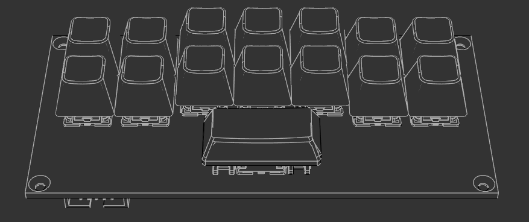

# Keypad Module (4U)

## Overview

The Keypad Module is a versatile 15-key RGB mechanical keyboard that can operate in two modes: as an integrated OTS module communicating via CAN bus, or as a standalone USB HID device.



<!-- TODO: Add keypad PCB layout -->


## Module Specifications

- **Size**: 4U
- **Rack Position**: Column 1, Position 3
- **Module Type**: Input with RGB feedback
- **Bus**: Dual-mode - CAN (suitcase mode) or USB HID (standalone mode)
- **Power**: 5V from suitcase bus or USB
- **Controller**: M5Stack Stamp S3 (ESP32-S3)

## Description

The **Keypad Module** provides 15 programmable mechanical keys with individual RGB LED feedback. It's designed to be used either integrated into the OTS suitcase (communicating via CAN bus) or as a standalone USB keyboard for desktop use. Each key features Cherry MX-compatible switches with transparent, user-labelable keycaps.

## Purpose

The Keypad Module serves as:
- **Game control interface**: Quick access to frequently-used OpenFront.io commands
- **Visual feedback system**: RGB LEDs indicate game state (e.g., action availability, cooldowns)
- **Standalone keyboard**: Functions as USB HID device when not in suitcase
- **Customizable input**: User-programmable key bindings and labels

## Hardware Components

### Physical Layout

```
Row 1: [ 1 ] [ 2 ] [ 3 ] [ 4 ] [ 5 ] [ 6 ] [ 7 ]
Row 2: [ 8 ] [ 9 ] [10 ] [11 ] [12 ] [13 ] [14 ]
Row 3:        [    15 (2U Spacebar)    ]
```

- **14x 1U keys**: Standard Cherry MX switches with 1U keycaps
- **1x 2U key**: Centered spacebar position with 2U keycap
- **Key switches**: Cherry MX-compatible mechanical switches (soldered to PCB)
- **Keycaps**: Transparent/translucent for RGB backlighting, user-labelable
- **Mounting**: Plate-mount design (switches mount to front panel, then solder to PCB)

### RGB LEDs

- **Type**: SK6812-MINI-E individually addressable RGB LEDs
- **Mounting**: Reverse mounted on PCB back side (PCB-facing LEDs, light shines through to keys)
- **Count**: 15 (one per key)
- **Control**: ESP32-S3 firmware with RMT peripheral
- **Data Protocol**: Same as WS2812 (800kHz, GRB color order)
- **Modes**:
  - Game state indicators (action availability, cooldowns, alerts)
  - Keypress feedback (flash/pulse on press)
  - User-configurable colors and effects
  - Idle animations/breathing effects

### Controller

- **Board**: M5Stack Stamp S3
- **MCU**: ESP32-S3 (dual-core Xtensa LX7)
- **Features**:
  - USB HID support (native USB)
  - CAN bus support (TWAI peripheral)
  - GPIO for key matrix scanning
  - RMT peripheral for WS2812 control
  - WiFi (optional for future features)

### Power

- **Suitcase mode**: 5V from OTS bus
- **Standalone mode**: USB 5V (500mA max)
- **Consumption**: ~200mA typical (keys + RGB at medium brightness)

## Operating Modes

### Mode 1: Suitcase Mode (CAN Bus)

When integrated into the OTS suitcase:

- **Communication**: CAN bus (TWAI)
- **Power**: 5V from suitcase bus
- **Protocol**: 
  - Follows existing CAN discovery protocol (MODULE_ANNOUNCE, MODULE_QUERY)
  - Key events sent as CAN messages (format TBD)
  - RGB LED commands received via CAN (format TBD)
- **Firmware**: CAN mode enabled at compile time
- **Discovery**: Announces as keypad module on bus

**CAN Protocol** (to be defined):
- Key press/release events
- Key ID (1-15)
- Timestamp
- Modifiers (if applicable)

**LED Control** (to be defined):
- Set individual key LED color
- Set all keys to color
- Brightness control
- Effect triggers (flash, pulse, fade)

### Mode 2: Standalone Mode (USB HID)

When used as standalone keyboard:

- **Communication**: USB HID (keyboard device)
- **Power**: USB 5V
- **Protocol**: Standard HID keyboard reports
- **Firmware**: USB HID mode enabled at compile time
- **Configuration**: 
  - Keys mapped to configurable keyboard shortcuts
  - LED control via USB vendor-specific commands (optional)
  - Configuration saved to flash

### Mode Selection

- **Build flags**: Firmware compiled with CAN, USB, or both modes enabled
- **No physical switch**: Mode selection is purely firmware-based (no jumpers or DIP switches)
- **Runtime detection** (when both enabled):
  - Auto-detect CAN bus activity on startup
  - Fall back to USB HID if no CAN detected
  - Default: Both modes enabled in firmware build

## Default Key Mapping

Default configuration maps keys to OpenFront.io main action bar and common keybinds:

| Key | Default Function | OpenFront Keybind |
|-----|------------------|-------------------|
| 1-7 | Main action bar slots 1-7 | `1`, `2`, `3`, `4`, `5`, `6`, `7` |
| 8 | Build menu | `B` (example) |
| 9 | Attack command | `A` (example) |
| 10 | Defense command | `D` (example) |
| 11 | Economy command | `E` (example) |
| 12 | Select all army | `Ctrl+A` (example) |
| 13 | Select all cities | `Ctrl+C` (example) |
| 14 | Next city | `Tab` (example) |
| 15 (Space) | Pause/Resume | `Space` |

**Note**: Actual OpenFront.io keybinds TBD - to be verified with game interface.

## LED Feedback Behavior

### Game State Indicators (Suitcase Mode)

RGB LEDs reflect game state and action availability:

- **Available action**: LED lit in primary color (e.g., green)
- **Unavailable action**: LED dimmed or off (e.g., cannot build city - insufficient resources)
- **Cooldown active**: LED pulsing/breathing (action on cooldown)
- **Alert state**: LED flashes red (e.g., under attack, critical alert)
- **Default/idle**: LED in secondary color at low brightness

### Keypress Feedback

On key press/release:
- **Press**: LED flashes bright white or configured color
- **Release**: LED returns to state indicator color
- **Hold**: LED pulses while held (optional)

### Standalone Mode

When used as USB keyboard:
- Static colors (user-configurable)
- Rainbow/cycling effects
- Breathing effects
- Reactive to keypresses

## Firmware Architecture

### Main Components

1. **Key Matrix Scanner**: 3×7 matrix scan at 1kHz
2. **Debouncing**: 5-10ms debounce per key
3. **LED Controller**: WS2812 management via RMT
4. **CAN Driver**: TWAI peripheral (suitcase mode)
5. **USB HID Stack**: TinyUSB (standalone mode)
6. **State Manager**: Tracks game state and LED states
7. **Configuration**: NVS storage for key mappings and settings

### Key Scanning

- **Method**: Matrix scanning (3 rows × 7 columns)
- **Algorithm**: 
  1. Set all row GPIOs HIGH (idle state)
  2. For each row: drive LOW, read all column pins
  3. Closed switch = column reads LOW (row pulled down)
  4. Repeat for all 3 rows
- **Rate**: 1kHz matrix scan (full 3-row scan every 1ms)
- **Debounce**: Software debouncing, ~5ms
- **Anti-ghosting**: 1N4148 diodes per switch prevent ghosting
- **Events**: Press, release, hold detection

### LED Update Rate

- **State changes**: Immediate update on game state change
- **Animations**: 60 FPS (16.67ms interval)
- **Brightness**: Adjustable 0-255, default 128

## CAN Bus Protocol

### Module Discovery

Follows standard OTS CAN discovery protocol:

- **CAN ID**: 0x430 (keypad module base ID)
- **Module Type**: `MODULE_TYPE_KEYPAD` (0x02)
- **Capabilities**: 15 keys, 15 RGB LEDs

### Key Event Messages

Final format (see `/prompts/CANBUS_MESSAGE_SPEC.md`):

```
CAN ID: 0x430 + key_id (0x431-0x43F)
DLC: 4 bytes
Data:
  Byte 0: Key ID (1-15)
  Byte 1: State (0x00=released, 0x01=pressed)
  Byte 2-3: Timestamp (16-bit, little-endian, milliseconds)
```

### LED Control Messages

Final format (see `/prompts/CANBUS_MESSAGE_SPEC.md`):

**Set individual key LED:**
```
CAN ID: 0x430
DLC: 5 bytes
Data:
  Byte 0: Key ID (1-15, or 0xFF for all keys)
  Byte 1: State (0=off, 1=on)
  Byte 2: Red (0-255)
  Byte 3: Green (0-255)
  Byte 4: Blue (0-255)
```

**Set multiple keys (bulk/bitmask):**
```
CAN ID: 0x440
DLC: 8 bytes
Data:
  Byte 0-1: Key bitmask (15 bits, little-endian)
  Byte 2: Red (0-255)
  Byte 3: Green (0-255)
  Byte 4: Blue (0-255)
  Byte 5: State (0=off, 1=on)
  Byte 6-7: Reserved
```

## USB HID Protocol (Standalone Mode)

- **Device Class**: HID Keyboard
- **Report Descriptor**: Standard 6-key rollover (or NKRO)
- **Vendor Commands**: Optional vendor-specific commands for LED control
- **Configuration Interface**: Web-based config portal via USB CDC (optional future feature)

## PCB Design

### Overview

- **Project**: KiCAD project in `/ots-hardware/kicad/keyboard_rev1.zip`
- **Revision**: Rev 1
- **PCB Specs**: 2-layer, 1.6mm thickness
- **Dimensions**: Sized to fit 4U module panel
- **Mounting**: Plate-mount switches (switches mount to front panel, then solder to PCB)

### PCB Layout

```
Top Side (Component Side):
- M5Stack Stamp S3 (surface mount)
- Cherry MX switch footprints (soldered, not hot-swap)
- 15x 1N4148 diodes (one per switch, anti-ghosting)
- CAN transceiver (TJA1050)
- USB-C connector (right edge)
- Bus connector (standard OTS bus connector)

Bottom Side (Solder Side):
- SK6812-MINI-E RGB LEDs (reverse mounted)
- Passive components
- CAN termination components
```

### Matrix Wiring

**Key Matrix Layout:**
```
        COL0  COL1  COL2  COL3  COL4  COL5  COL6
ROW0:   [K1]  [K2]  [K3]  [K4]  [K5]  [K6]  [K7]
ROW1:   [K8]  [K9]  [K10] [K11] [K12] [K13] [K14]
ROW2:   ---   ---   [K15 (2U spacebar)]  ---  ---
```

**Diode Configuration:**
- Each switch has a 1N4148 diode in series
- Diode cathode toward row line (standard matrix orientation)
- Prevents ghosting when multiple keys pressed simultaneously
- SMD or through-hole diodes (SOD-123 package for SMD)

### Key Components

#### Controller
- **Module**: M5Stack Stamp S3
- **Mounting**: Surface mount soldered to PCB
- **GPIO Allocation**:
  - 10x GPIO for key matrix (3 rows + 7 columns)
  - 1x GPIO for WS2812 data (RMT peripheral)
  - 2x GPIO for CAN (TX/RX to TJA1050)
  - USB pins (native ESP32-S3 USB)

#### CAN Bus Interface
- **Transceiver**: TJA1050 (same as other OTS modules)
- **Connector**: Standard OTS bus connector (CAN H/L + 5V/GND)
- **Termination**: Onboard 120Ω termination (optional/switchable if needed)
- **Protection**: ESD protection on CAN lines

#### USB Interface
- **Connector**: USB-C (right edge of PCB)
- **Position**: Accessible when module installed in suitcase
- **Orientation**: Standard orientation for easy cable access
- **Features**: 
  - 5.1kΩ CC pull-downs for USB 2.0 mode
  - ESD protection on data lines
  - Fuse/polyfuse optional

#### RGB LEDs
- **Type**: SK6812-MINI-E (reverse mount variant)
- **Count**: 15 (one per key)
- **Mounting**: Reverse mounted on PCB back side
- **Wiring**: Chained data line (DIN → DOUT)
- **Power**: 5V rail with decoupling caps per LED group
- **Brightness**: Firmware-controlled to manage current draw

#### Key Switches
- **Type**: Cherry MX-compatible switches
- **Mounting**: Plate-mount (switches clip into front panel plate)
- **Connection**: Through-hole solder pads on PCB
- **Layout**: 
  - Row 1: 7x 1U switches (keys 1-7)
  - Row 2: 7x 1U switches (keys 8-14)
  - Row 3: 1x 2U switch (key 15, centered spacebar)
- **Scanning**: 3×7 matrix scanning
  - 3x row GPIOs (outputs, driven LOW to scan)
  - 7x column GPIOs (inputs with pull-ups)
  - Active-low: closed switch connects row to column
  - Diodes: 1N4148 per switch (anti-ghosting)
  - Scan rate: 1kHz (1ms per full matrix scan)

### Connectors

| Connector | Type | Location | Purpose |
|-----------|------|----------|---------|
| **Bus** | Standard OTS bus connector | PCB edge | CAN H/L + 5V + GND |
| **USB-C** | USB-C receptacle | Right edge | USB data + 5V power (standalone mode) |

### Power Distribution

```
5V Input (from bus or USB)
  ↓
  ├→ M5Stack Stamp S3 (ESP32-S3)
  ├→ SK6812-MINI-E LEDs (via current-limiting)
  └→ TJA1050 CAN transceiver
```

- **Input**: 5V from bus connector OR USB-C (diode OR circuit prevents conflict)
- **Regulation**: ESP32-S3 has onboard 3.3V regulator on Stamp S3 module
- **LED Power**: Direct 5V with series resistor on data line
- **Max current**: ~1A (all 15 LEDs at max brightness)

### Assembly Notes

#### Manufacturing
- **PCB**: Standard 2-layer FR4, 1.6mm
- **Manufacturer**: Any PCB fab (JLCPCB, PCBWay, etc.)
- **Surface Finish**: ENIG or HASL (ENIG preferred for USB/CAN)
- **Silkscreen**: Key numbers and component references

#### Assembly Process

1. **SMT Assembly**:
   - Solder M5Stack Stamp S3 (surface mount)
   - Solder SK6812-MINI-E LEDs on PCB back (reverse mount)
   - Solder TJA1050 and passives
   - Solder USB-C connector

2. **Plate Mounting**:
   - Insert Cherry MX switches into front panel plate
   - Align plate+switches with PCB
   - Ensure switch pins protrude through PCB holes

3. **Final Soldering**:
   - Solder all 15 switches to PCB
   - Trim excess leads
   - Solder bus connector

4. **Testing**:
   - Flash test firmware via USB
   - Verify all keys register
   - Test RGB LEDs (full cycle)
   - Test CAN communication (if equipped)

#### Hand Assembly Friendly
- All components hand-solderable
- SK6812-MINI-E requires careful temperature control (260°C max)
- M5Stack Stamp S3 has large pads, easy to hand-solder
- Switch soldering straightforward with plate alignment

### Mode Configuration

- **No physical mode switch**: Mode selection is firmware-only
- **Default**: Both CAN and USB modes enabled in firmware
- **Build flags**: 
  - `ENABLE_CAN_MODE`: Compile with CAN support
  - `ENABLE_USB_MODE`: Compile with USB HID support
  - Both defined by default
- **Runtime behavior**: Auto-detect CAN bus presence, fall back to USB if no CAN

### Known Issues / Design Notes

- **Rev 1 Notes**: (document any errata or improvements for next revision)
- **LED routing**: Data line routed to minimize noise interference with USB
- **Switch spacing**: Standard MX spacing (19.05mm center-to-center)
- **Keycap clearance**: PCB height allows standard keycap profiles

## Power Budget

- **Keys**: Negligible (mechanical switches)
- **RGB LEDs**: 15 keys × 60mA max (full white) = 900mA max
- **ESP32-S3**: ~100mA typical
- **Total max**: ~1A (all LEDs full brightness white)
- **Typical usage**: ~200mA (LEDs at 25% brightness, varied colors)

**Power management:**
- Limit LED brightness to prevent exceeding 500mA USB limit in standalone mode
- Full brightness available in suitcase mode (5V bus can supply more current)

## Mounting

- Standard 4U front panel mounting
- Keys arranged in ergonomic layout
- Transparent keycaps allow RGB illumination
- Module depth: ~40mm (including switches and keycaps)

## Customization

### User-Replaceable Components

- **Keycaps**: Standard Cherry MX-compatible, user can swap or label
- **Switches**: Soldered to PCB (not hot-swappable - requires desoldering to replace)
- **Labels**: Keycap labeling (stickers, printing, or transparent inserts)

**Note**: While switches are soldered, they can be replaced with desoldering tools if needed. Front panel provides mechanical stability for switch retention.

### Configuration

- **Key mapping**: Configurable via firmware (NVS storage)
- **LED colors**: Per-key color configuration
- **Brightness**: Global brightness adjustment
- **Effects**: Selectable LED effects for idle/press states

## Firmware Integration

### Main Controller Communication (Suitcase Mode)

The main controller (`ots-fw-main`) will:
1. Discover keypad module via CAN
2. Send LED commands based on game state
3. Receive key events and translate to game commands
4. Forward commands to userscript via WebSocket

### Standalone Firmware

Independent firmware running on Stamp S3:
- TinyUSB stack for HID
- Key scanning and debouncing
- LED control and animations
- Configuration storage
- Mode switching (if both modes enabled)

## Protocol Specification Status

**Current Status**: Initial specification

**To Be Defined**:
- [ ] Exact CAN message IDs and formats for key events
- [ ] Exact CAN message IDs and formats for LED control
- [ ] Integration with main controller firmware
- [ ] WebSocket protocol for keypad events (fw-main → simulator)
- [ ] Game state → LED mapping logic
- [ ] Configuration protocol (if configurable via main controller)

**Next Steps**:
1. Define CAN protocol in `/prompts/CANBUS_MESSAGE_SPEC.md`
2. Add keypad protocol to `/doc/developer/canbus-protocol.md`
3. Create firmware project: `ots-fw-keypad/`
4. Create shared CAN protocol component: `ots-fw-shared/components/can_protocol_keypad/`
5. Integrate with main controller firmware
6. Add WebSocket events for keypad in `prompts/WEBSOCKET_MESSAGE_SPEC.md`

## Future Enhancements

- **OLED display**: Small OLED per key (like Stream Deck) for dynamic labels
- **Macro recording**: Record and playback key sequences
- **Profiles**: Multiple configuration profiles (per game or scenario)
- **WiFi configuration**: Web-based config portal (ESP32-S3 AP mode)
- **Wireless mode**: Battery + WiFi/BLE for wireless operation (major redesign)

## Related Documentation

- Hardware specification: `/ots-hardware/hardware-spec.md`
- CAN bus protocol: `/prompts/CANBUS_MESSAGE_SPEC.md`
- Main controller: `/ots-fw-main/`
- Shared components: `/ots-fw-shared/components/`

---

**Status**: Initial specification - Protocol details and firmware implementation pending.
